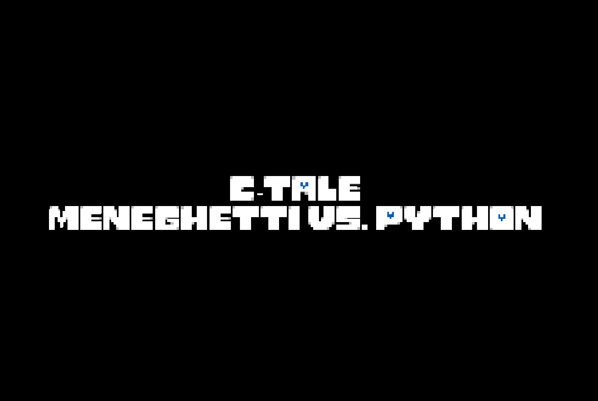
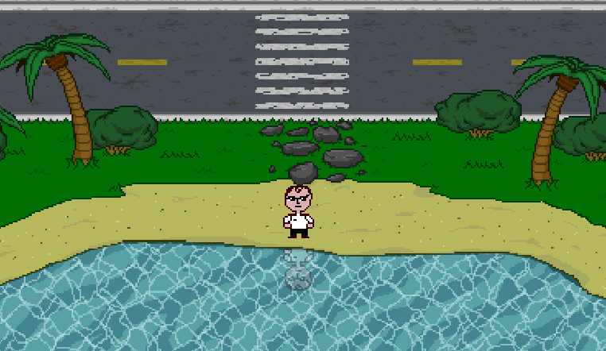
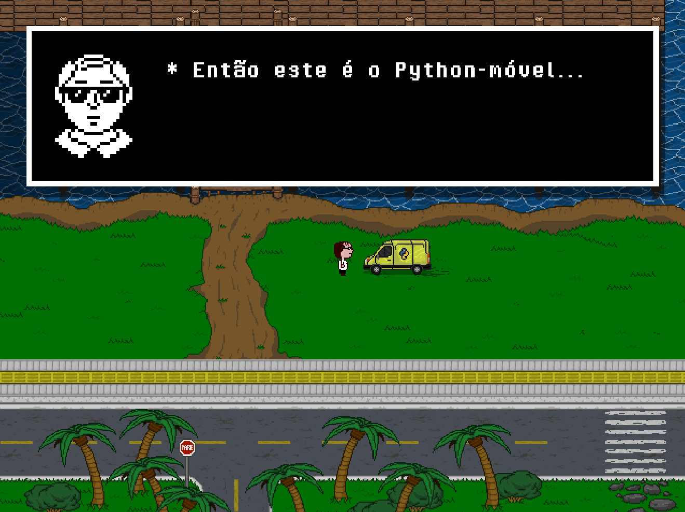
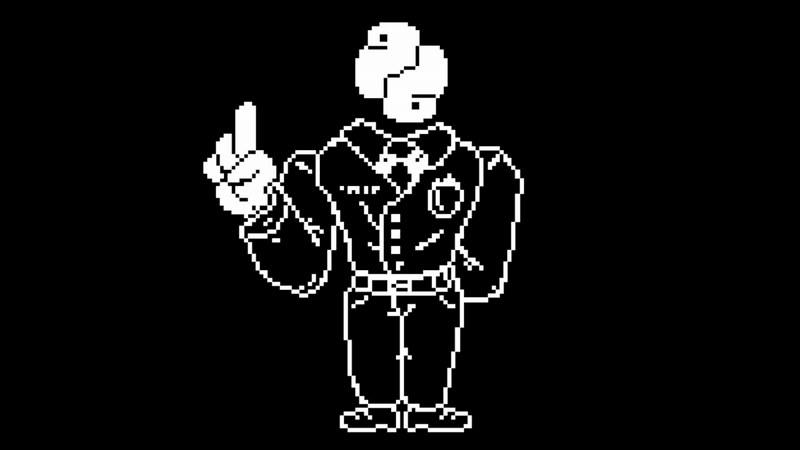

<h1 align="center">C-Tale: Meneghetti VS Python</h1>
<p align="center">
  
  
  
</p>
<p align="center">
🐍 A 2D RPG based off Undertale, made with <a href="https://wiki.libsdl.org/SDL2">SDL2</a>. A short humoristic rip-off for an university project. 🐍
</p>

## 👾 Table of Contents
- [Project Status](#project-status)
- [Roadmap](#roadmap)
- [Screenshots](#screenshots)
- [Setup](#setup)
- [Usage](#usage)
- [Authors](#authors)
- [Acknowledgements](#acknowledgements)
- [License](#license)

## 🔋 Project Status
Project is: _complete_.

## 🗺️ Roadmap
- [x] 🎨 Sprites
- [x] 🏃 Character movement
- [x] 💬 NPC interaction
- [x] ⚔️ Battle system
- [x] 🎒 Items
- [x] 🚩 Ending sequence
## 💡 Future Goals
- [ ] 🌍 Multiple scenarios
- [ ] ⚔️ Different battles
- [ ] 🚂 Different game modes
- [ ] 🪙 Different endings
- [x] 👾 Debug mode

## 📸 Screenshots

| Title Screen | Meneghetti en la Playa |
|--------------|-------------------------|
|  |  |

| In-game Dialogue | Mr. Python (Animation) |
|-----------------|------------------------|
|  |  |

## 💾 Setup
- __Windows:__

 We recommend using [_MSYS2_](http://msys2.org/) with the MINGW64 toolchain (more stable and simple). Install it at the official website, then search for "MSYS2 MINGW64" in your search bar (the blue one).

 Now, just execute the following commands in there:

__Commands:__

```
# updates the MSYS2 system (may request to reopen the shell)
pacman -Syu
```

If you get some error here, try:

```
pacman -Syuu
```

Now, for the dependencies (if the terminal stops asking for a input, just hit Return):

```
pacman -S --needed base-devel mingw-w64-ucrt-x86_64-toolchain mingw-w64-ucrt-x86_64-cmake mingw-w64-ucrt-x86_64-pkg-config
```

Got any problems with package conflict in the last step? Try this line:

```
pacman -S --needed base-devel mingw-w64-ucrt-x86_64-toolchain mingw-w64-ucrt-x86_64-cmake
```

If everything's good so far, here goes the last step:

```
pacman -S mingw-w64-ucrt-x86_64-SDL2 mingw-w64-ucrt-x86_64-SDL2_image mingw-w64-ucrt-x86_64-SDL2_ttf mingw-w64-ucrt-x86_64-SDL2_mixer
```

Then, to build the program, go into the repo directory with your shell, and execute the following:

```
mkdir build
cd build
cmake ..
make
```

The executable will be on the build file after that.

> projeto-rpg\build\c_tale.exe

<hr>

- __Linux:__

 First, install/update the SDL2 library on the console. Then, just build the program with the CMakefile command (same as Windows, the code just below), execute the main code, and have fun. (May be redundant, but you should also have GCC and CMake support installed).

 ```
(on repo directory):
mkdir build
cd build
cmake ..
make
```

You can execute the code after that.

> projeto-rpg/build/c_tale

__Commands:__

```
sudo apt update && sudo apt install -y build-essential cmake pkg-config libsdl2-dev libsdl2-image-dev libsdl2-ttf-dev libsdl2-mixer-dev
```

If you don't have GCC:

```
sudo apt update
```

```
sudo apt install gcc
```

<hr>

- __Extras:__

__Fedora, Oracle, Rocky, etc.:__

```
sudo dnf install SDL2-devel gcc make cmake
```

__Arch:__

```
sudo pacman -S sdl2 gcc make cmake
```

## 🎮 Usage
WASD to walk, E to interact, TAB to go back, ENTER to begin the game. If you wish to test and debug the code, press F7 to open the game state button chart.

Walk up to the NPC, press E to interact, defeat it in battle mode, reach the final object.

## 🖋️ Authors
[@danilocb21](https://github.com/danilocb21): main programmer.

[@williamdants62](https://github.com/williamdants62): artist, programmer.

[@RicardinhoGplays](https://github.com/RicardinhoGplays): creative director, artist.

## ©️ Acknowledgements
The project was highly inspired on famous media.
- [Undertale](https://undertale.com/) (2015), by Toby Fox.

## 📙 License
This project is open source and available under the [MIT License](./LICENSE).
